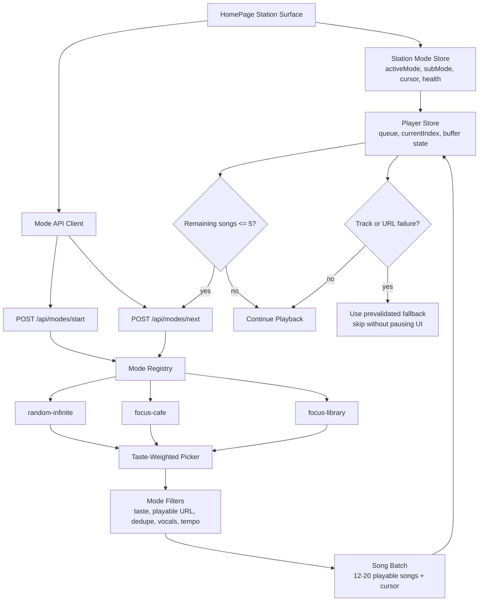

# Infinite Station Themes Design

## Goal

Build an independent infinite music-flow module for Claudio with three station surfaces: Random Infinite, Cafe, and Library. The module must not use `/api/chat`, must not create chat messages, must not trigger TTS, and must prioritize uninterrupted music playback.

## Confirmed Decisions

- No Claudio intro for station modes.
- Station mode requests do not use DeepSeek chat, chat history, or TTS.
- Station modes are homepage themes, not small widgets inside the existing default home UI.
- User-initiated mode switches fade out the current song immediately, then enter the new station surface.
- `Cafe` and `Library` live under one `Focus Space` module with a sub-mode switch.
- `Cafe` is a dim original-wood cafe atmosphere: lofi, jazzhop, clean groove, and low vocal tracks are allowed.
- `Library` is warm yellow reading-light atmosphere: quiet, soft, paper/desk feeling, and strictly instrumental.
- `Random Infinite` is a signal-flow exploration theme with more motion and discovery energy.
- Every mode prioritizes the user's taste memory before generic recommendations.
- The infinite stream should hide network/provider failures through buffering, prefetch, fallback songs, and retry logic.

## Product Model

The homepage gets a station surface layer above the current player. The default Claudio FM home remains available, but selecting Random, Cafe, or Library replaces the main home presentation with the corresponding theme.

`Random Infinite` behaves like a live signal scan. It should feel exploratory and kinetic, with a flowing queue, signal-style status, and visibly active track discovery.

`Focus Space` behaves like a quiet environment selector. Its primary surface contains two sub-modes:

- `Cafe`: dim, warm, original wood, comfortable shadows, soft reflections, and gently moving audio visuals.
- `Library`: warm yellow desk lamp, page texture, quiet spacing, low motion, strict instrumental curation.

## Architecture

## Backend Design

Create a new mode API instead of extending `/api/chat`.

Endpoints:

- `POST /api/modes/start`
  - Body: `{ mode: "random-infinite" | "focus-cafe" | "focus-library" }`
  - Returns: `{ mode, cursor, songs, health }`
- `POST /api/modes/next`
  - Body: `{ mode, cursor, excludeSongIds }`
  - Returns: `{ mode, cursor, songs, health }`

The mode service should return only playable song metadata. It should not return intro text, TTS URLs, or chat content.

Song selection pipeline:

1. Load user taste hints from memory and recent plays.
2. Build mode-specific search seeds.
3. Fetch more candidates than needed.
4. Verify playable URLs before returning.
5. Filter by mode rules.
6. Remove duplicates from current queue, recent plays, and recent failures.
7. Return a stable batch and cursor.

Mode rules:

- `random-infinite`: broad discovery, taste-weighted, no strict vocal filter.
- `focus-cafe`: lofi, jazzhop, mellow R&B-adjacent, cafe instrumentals, low vocals allowed, no aggressive tracks.
- `focus-library`: instrumental only, no obvious lead vocal, no rap, no lyrical pop, no spoken intros, low distraction.

## Frontend Playback Design

Add station state to the player layer without disturbing the existing chat/TTS playback.

State fields:

- `activeStationMode`
- `stationCursor`
- `stationHealth`
- `stationBuffering`
- `stationQueueMin`
- `stationRecentFailures`

Playback behavior:

- Starting a station fades out the current song.
- The new mode fetches an initial batch before playback begins.
- The player starts once at least one playable song is available.
- The client requests the next batch when remaining queued songs are `<= 5`.
- Next-batch requests run in the background and must not touch the current audio element.
- If a track fails, mark it failed and jump to the next prevalidated track.
- If the network is slow, continue playing buffered tracks and show a small health state instead of stopping.
- Exiting station mode stops auto refill and returns to the normal Claudio home behavior.

## Theme UI Design

### Random Infinite

Visual language: signal scan, moving waveform bands, dot-matrix telemetry, active discovery.

UI elements:

- Large current signal/title area.
- Flowing queue preview rather than a static playlist.
- Health indicator: `BUFFERED`, `REFILLING`, `TUNNEL SLOW`, or `LOCAL`.
- More animated spectrum and scanning line movement than the focus modes.

### Focus Space: Cafe

Visual language: dim original-wood cafe, warm low light, comfortable shadows.

UI elements:

- Wooden-panel inspired background treatment using CSS textures, not stock cafe imagery.
- Warm amber controls with subtle highlights.
- Softer waveform with slow sway.
- Sub-mode switch clearly shows `Cafe` and `Library`.
- Track cards should feel like small table cards, not playlist rows.

Music rules:

- Allow lofi, jazzhop, mellow instrumental hip-hop, soft jazz, warm low vocal tracks.
- Reject loud rock, aggressive EDM, rap-forward tracks, and bright pop vocals.

### Focus Space: Library

Visual language: warm yellow reading lamp, paper, desk, quiet spacing.

UI elements:

- Warm ivory/yellow lighting palette.
- Paper-grid or page-fiber texture.
- Minimal motion; spectrum should be low and restrained.
- More whitespace and lower visual density than Cafe.
- Controls feel precise and quiet, like reading tools.

Music rules:

- Strict instrumental.
- Reject tracks with obvious lead vocals, rap, spoken-word openings, or lyric-heavy pop.
- Prefer piano, ambient, light classical, soft instrumental jazz, study beats without voice.

## Reliability Requirements

The system cannot guarantee that Cloudflare, NCM, or the public network never fails. It must guarantee that common failures are absorbed before the user hears silence.

Required safeguards:

- Initial batch should target 15 playable songs.
- Refill should trigger at 5 remaining songs.
- Refill should request 12-20 songs.
- Current audio element must never be reset during refill.
- Track URLs must be checked before being accepted into the queue.
- Failed songs are remembered for the session and excluded from future batches.
- If `/api/modes/next` fails, retry with backoff while continuing current buffer.
- If NCM returns too few mode-matching songs, use local library fallback with the same mode filters.
- If Cloudflare tunnel is slow, client should continue using the local buffer and avoid repeated concurrent refill storms.

## Cloudflare And Bandwidth Behavior

Cloudflare tunnel should carry API calls and browser audio requests, but mode refill must be conservative.

Rules:

- Only one refill request per station at a time.
- Do not fire refill on every render or every progress tick.
- Refill only when crossing the remaining-song threshold.
- Avoid downloading full audio files for validation; use NCM URL availability checks and browser preload only for the next track.
- The frontend preloads only the next track, not the full queue.

## Testing Plan

Server tests:

- Mode start returns playable songs for all three modes.
- Mode next returns a new cursor and excludes provided song IDs.
- Cafe allows low-vocal candidates but rejects aggressive/high-energy seeds.
- Library rejects vocal/rap/pop-lyric candidates.
- Random uses taste weighting but does not collapse to one artist.
- Mode routes do not call DeepSeek, TTS, or messagesRepo.

Player tests:

- Starting a station fades out current playback and starts the new queue.
- Refill triggers at `<= 5` remaining songs.
- Refill does not reset or pause the current audio element.
- Failed track skips to the next buffered track.
- Refill failure leaves existing playback running.
- Exiting station mode stops auto refill.

UI tests:

- Random, Cafe, and Library each apply distinct station surface classes.
- Cafe and Library appear under one Focus Space module.
- Library surface uses warm reading-light styling.
- Cafe surface uses dim original-wood styling.
- Station modes do not render TTS overlay content or chat messages.

Network tests:

- Simulate slow `/api/modes/next` and verify playback continues.
- Simulate empty response and verify fallback pool is used.
- Simulate 500 response and verify retry/backoff without duplicate requests.
- Simulate Cloudflare-like latency and verify only one refill is in flight.

## Implementation Boundaries

This feature should be implemented as a dedicated station subsystem:

- New backend mode service and route.
- New frontend station API client.
- New station mode state in player or a focused station store.
- New homepage station surfaces.
- Targeted changes to existing player behavior only where needed for fade, append, and refill.

Do not:

- Reuse `/api/chat`.
- Generate or synthesize intros.
- Write station events as chat messages.
- Mix station refill with AIDJ or daily recommendation prompts.
- Download full queues of audio files at once.

## Open Implementation Notes

The exact CSS palette and spacing will be decided during implementation with browser screenshots. The functional contract above is fixed: no intro, no chat pollution, mode-specific UI, taste-weighted curation, and uninterrupted buffered playback.
